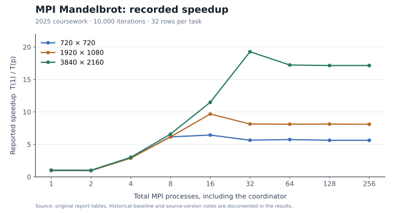
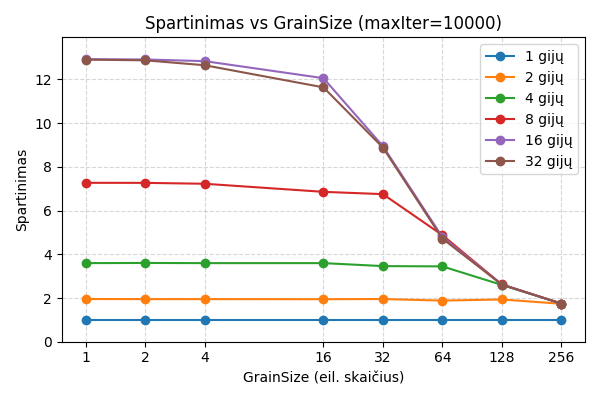
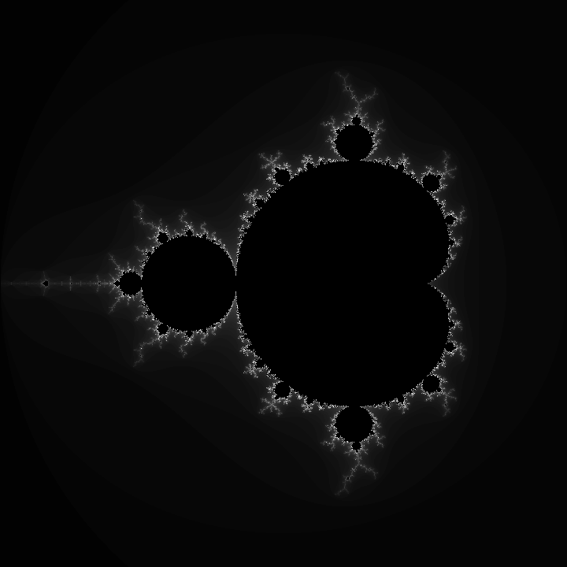
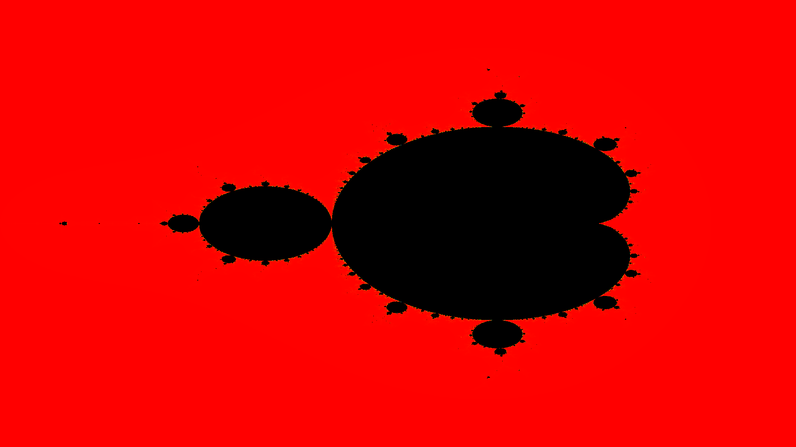
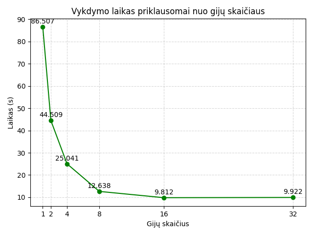
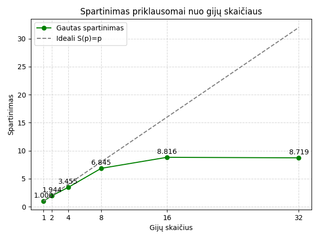
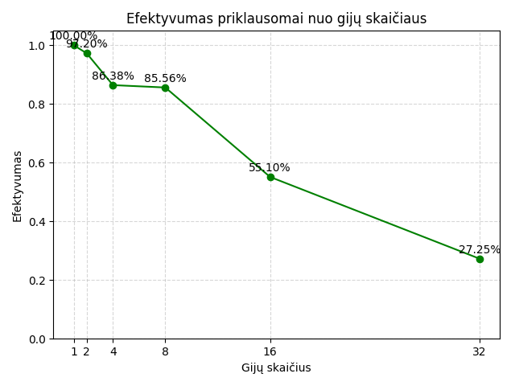
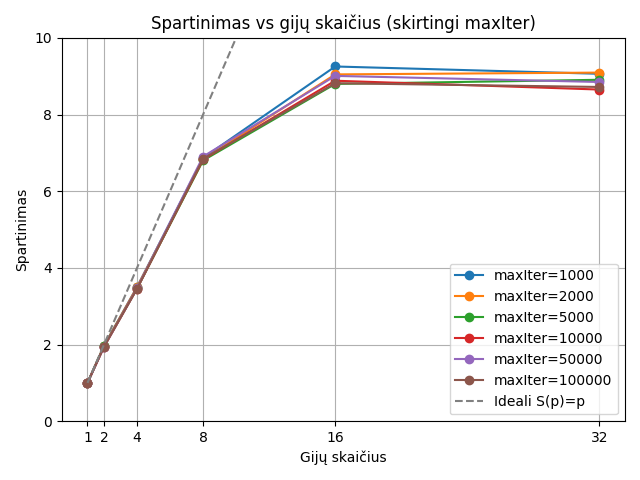
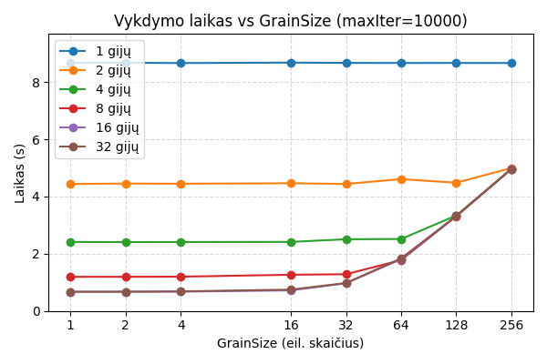
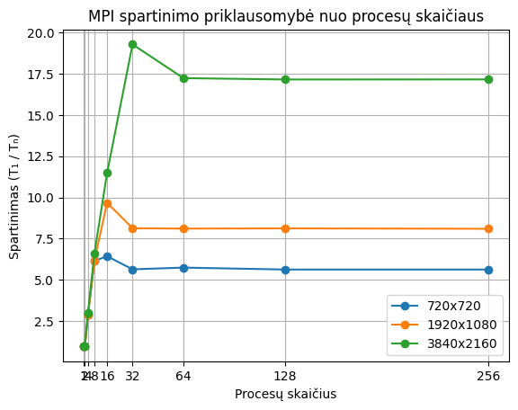

# Parallel Computing with Java and MPI

Four laboratory assignments from the **Parallel Computing** course at Vilnius University, Faculty of Mathematics and Informatics, completed in 2025. The collection covers shared mutable state, monitor synchronization, dynamic work scheduling with Java threads, and distributed Mandelbrot rendering with C and MPI.

Source code is accompanied by build instructions, original illustrations, recorded measurements and the two coursework reports.

| Lab | Implementation | Focus | Output |
| --- | --- | --- | --- |
| [1. Warehouse race](labs/01-warehouse-race/) | Java | Concurrent updates to shared inventory and value | Console totals |
| [2. Color monitor](labs/02-color-monitor/) | Java | Group mutual exclusion with `synchronized`, `wait` and `notifyAll` | Thread activity log |
| [3. Threaded Mandelbrot](labs/03-mandelbrot-java/) | Java | Dynamic row allocation with `AtomicInteger`; thread and grain-size experiments | PNG image and timing data |
| [4. MPI Mandelbrot](labs/04-mandelbrot-mpi/) | C / MPI | Coordinator-worker scheduling and explicit message passing | PPM image and processing time |

[Getting started](#getting-started) · [Run each lab](#run-each-lab) · [Recorded experiments](#recorded-experiments) · [Illustrations](#original-illustrations) · [Reports](#reports-and-data)

## Getting started

### Requirements

- A JDK with `java` and `javac`. JDK 17 or newer is a suitable choice for these Java sources.
- A C compiler and an MPI implementation providing `mpicc` and `mpirun`, such as Open MPI or MPICH, for lab 4.
- Make for the build shortcuts below. Each lab also documents direct compiler commands.
- A POSIX shell on macOS, Linux or WSL for the examples.

The Java programs use the standard JDK. The MPI renderer uses standard C and MPI. Python is only needed for the optional figure-generation script.

```sh
git clone https://github.com/lukamaga/parallel-computing-java-mpi.git
cd parallel-computing-java-mpi

make java
make mpi
```

`make java` compiles the three Java labs; `make mpi` builds the C renderer. Compiled files go into `build/`, which is excluded from Git. The commands below run from the repository root.

## Run each lab

### 1. Shared-state race

```sh
java -cp build/lab1 Main
```

Two threads repeatedly add and remove warehouse items. Both modify the same inventory count and total value. The active implementation is intentionally unsynchronized, so the final values can differ from the expected zero totals. A run that ends at zero does not establish thread safety. The source includes a commented synchronized alternative for the exercise.

[Lab 1 documentation](labs/01-warehouse-race/README.md)

### 2. Group synchronization

```sh
java -cp build/lab2 ColorDemo
```

Five white threads and five red threads share a monitor. Threads of the same color can enter together; the other group waits until the active group leaves. The monitor maintains separate counters and uses condition loops around `wait()`. The exercise illustrates how group exclusion differs from allowing only one thread into a critical section.

Console messages retain the original Lithuanian wording. Their order depends on thread scheduling.

[Lab 2 documentation](labs/02-color-monitor/README.md)

### 3. Java Mandelbrot renderer

```sh
java -cp build/lab3 Mandelbrot 4 720 720 1000 16 fast
```

Arguments: `threads width height maxIterations grainSize mode`.

Workers claim blocks of rows through an atomic counter. Each block is calculated independently, allowing workers to request more work as they finish. `grainSize` is the number of rows claimed at once. The command above writes `mandelbrot.png` in the current directory and prints rendering time in seconds. PNG encoding occurs after the timed section.

Use `debug` for a small scheduling trace:

```sh
java -cp build/lab3 Mandelbrot 4 80 60 100 8 debug
```

Debug mode prints row assignments without saving an image. A separate coursework timing driver reports results for 1, 2, 4, 8, 16 and 32 threads:

```sh
java -cp build/lab3 TTestMandelbrot 720 720 1000 16
```

The timing driver measures computation without image output. Its arguments and measurement limitations are described in the [lab 3 guide](labs/03-mandelbrot-java/README.md).

### 4. C / MPI Mandelbrot renderer

```sh
mpirun -np 4 ./build/lab4/mandelbrot_mpi 720 720 1000 16 build/lab4/mandelbrot.ppm
```

Program arguments: `width height maxIterations grainSize outputPath`. `-np` sets the total number of MPI processes, including the coordinator. With four processes, rank 0 distributes work to three rendering workers.

The coordinator sends the starting row of each block, receives computed RGB bytes, and assigns another block to the worker that finishes. The completed grayscale image is written as binary PPM. Open it with a viewer that supports PPM files.

For this implementation, use at least two processes and no more workers than available row blocks:

```text
processes >= 2
processes - 1 <= ceil(height / grainSize)
```

Use image dimensions greater than one and positive iteration and grain-size values. The output directory must already exist. The example above has 45 row blocks and three workers. A larger example is:

```sh
mpirun -np 8 ./build/lab4/mandelbrot_mpi 1920 1080 10000 32 build/lab4/mandelbrot-hd.ppm
```

The [lab 4 guide](labs/04-mandelbrot-mpi/README.md) explains the protocol, timing boundary and process-count constraints. [hpc/submit.slurm](hpc/submit.slurm) provides an eight-process submission template; adapt its scheduler and module settings to the target cluster before submitting it.

## Recorded experiments

The Java study compares thread count, iteration limit and row-block size. Its report identifies an Apple M3 Max with 16 CPU cores and 64 GB RAM. The MPI study compares three image sizes on a Slurm cluster using Open MPI. The MPI report does not specify the CPU model or node allocation, so the two studies are not a controlled Java-versus-C comparison.

The following summary comes from the original report tables. Complete values and source notes are available in the [recorded results](docs/results/historical-results.md).

| Study | Image size | Iteration limit | Best recorded configuration | Recorded time | Reported speedup |
| --- | --- | ---: | --- | ---: | ---: |
| Java | 1920 × 1080 | 100,000 | 16 threads | 9.772 s | 8.90× |
| MPI | 720 × 720 | 10,000 | 16 processes | 0.869972 s | 6.43× |
| MPI | 1920 × 1080 | 10,000 | 16 processes | 2.308023 s | 9.68× |
| MPI | 3840 × 2160 | 10,000 | 32 processes | 4.976401 s | 19.28× |

All four table rows use a grain size of 32. Speedup is the reported ratio `T(1) / T(p)`. These are historical measurements. The Java table and chart labels contain slightly different numeric series, both retained in the results. The exact MPI revision used for every recorded process count is not identified; an [archived serial-capable variant](archive/) is included alongside the primary coordinator-worker implementation.

### MPI scaling by image size



This figure replots the original report values with evenly spaced process-count labels. The original chart is included below. The largest workload reached its lowest recorded time at 32 processes; the smaller workloads reached theirs at 16. Further process increases did not improve these recorded runs.

### Java scheduling granularity



The horizontal axis is the number of rows in a task. In this recorded sweep, larger blocks reduce the speedup achieved by the higher thread counts. The original Lithuanian labels are retained: `gijų` means threads and `spartinimas` means speedup. The report does not restate the image dimensions for this sweep.

## Original illustrations

The saved MPI image below is extracted from the report and has the same pixel data as the original PPM file.



<details>
<summary>Java image and the complete original performance charts</summary>

### Java rendering



The exact thread count and iteration limit are not stored with this image. Its color palette differs from the MPI renderer's grayscale palette.

### Java runtime by thread count



### Java speedup by thread count



### Java efficiency by thread count



These three charts use the report's chart-label series. The separate report table is preserved in the [results](docs/results/historical-results.md#java-report-table).

### Java speedup by iteration limit



### Java runtime by grain size



### Original MPI speedup chart



</details>

All nine original illustrations, their captions and source locations are also collected in the [figure gallery](docs/results/gallery.md).

## Reports and data

| Material | Contents |
| --- | --- |
| [Java report, PDF](docs/reports/java-mandelbrot-report.pdf) | Hardware description, timing table, scaling and grain-size experiments, rendered output |
| [MPI report, PDF](docs/reports/mpi-mandelbrot-report.pdf) | Three image-size experiments, timing and speedup tables, chart and rendered output |
| [Historical results](docs/results/historical-results.md) | English explanation, complete tables and source-version notes |
| [Machine-readable results](docs/results/historical-results.json) | Reported numeric values and figure provenance |
| [MPI timing log](docs/results/mpi-10000-iterations-original.txt) | Original 27 measurements at 10,000 iterations |
| [Additional MPI log](docs/results/mpi-100-iterations-original.txt) | Short 100-iteration experiment, including a zero one-process timing |
| [Archived MPI variant](archive/) | Additional source version with a single-process rendering path |

The reports are in Lithuanian. Original numeric precision is retained in the data files. A zero-duration baseline in the short MPI log cannot provide a meaningful speedup ratio.

### Regenerate the summary figure

The plotting script reads the stored JSON and writes `docs/assets/mpi-speedup-summary.svg`.

```sh
python3 -m venv .venv
. .venv/bin/activate
python -m pip install -r scripts/requirements.txt
python scripts/plot_mpi_results.py
```

## Repository structure

```text
labs/
  01-warehouse-race/       Shared inventory exercise
  02-color-monitor/        Group synchronization
  03-mandelbrot-java/      Java renderer and timing driver
  04-mandelbrot-mpi/       MPI renderer
docs/
  assets/                  Original images and summary figure
  reports/                 Two original PDF reports
  results/                 Tables, source data, logs and gallery
archive/                   Additional MPI source variant
hpc/                       Slurm submission template
scripts/                   Optional summary-figure generation
Makefile                   Java and MPI build targets
ATTRIBUTION.md             Source mapping and course-material credits
```

## Author and acknowledgements

Lukaš Patrik Magalinski, Vilnius University, Faculty of Mathematics and Informatics. Course: *Lygiagretieji skaičiavimai*, 2025.

The Java timing driver follows the course benchmark structure by R. Vaicekauskas. See [ATTRIBUTION.md](ATTRIBUTION.md) for source mapping and teaching-material credits.
